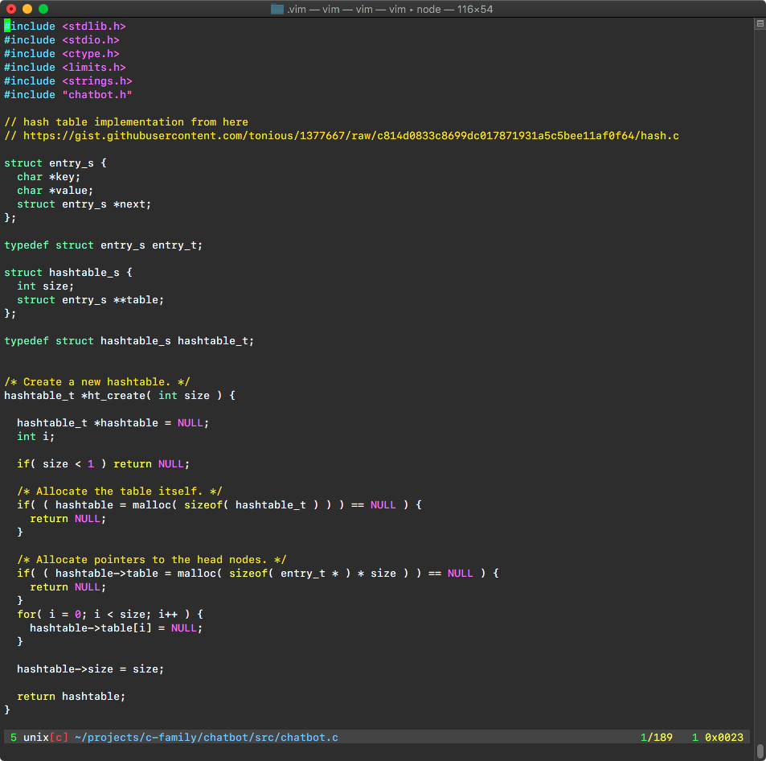

## .Vim

My vim configuration for writing Python, JavaScript, Go and Rust.



For terminal emulator, I use Alacritty in combination with Vim & tmux. IMHO, it has the fastest Developer Experience on Mac.

### How to Install?

This project uses plug for plugin management so we will first need to install plug
and then update all the plugins. In order to install the latest version, just run this `curl` or `wget`
script and it will setup the vim for you.

curl:

```sh
sh -c "$(curl -fsSL https://raw.githubusercontent.com/vinitkumar/.vim/master/install.sh)"
```

wget:

```
sh -c "$(wget https://raw.githubusercontent.com/vinitkumar/.vim/master/install.sh)"
```

### Purpose

This config is meant for one purpose only and that is speed and accuracy. The plugins are restricted 
to a mininum.

This config is based on the vimrc of [@antirez's](github.com/antirez) gist for his vimrc. 
